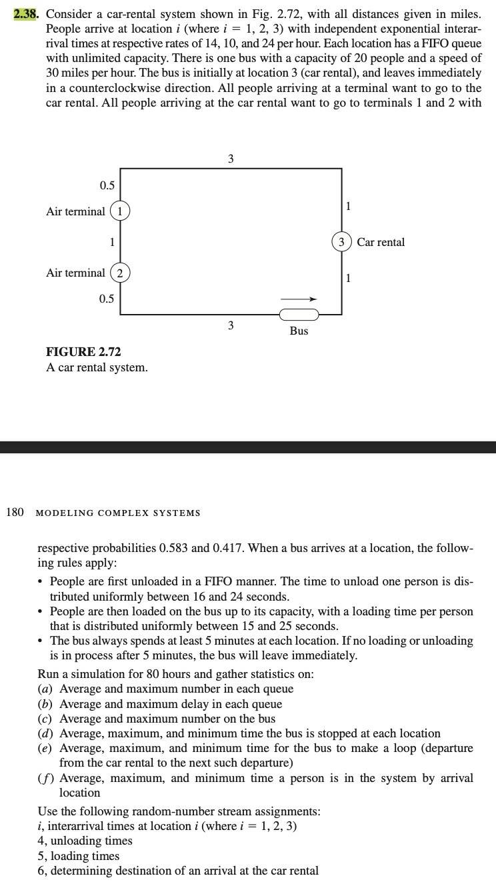

# Car rental SIMLIB

> Problem 2.38 of book `Simulation Modeling and Analysis 5e`

## How to run

0. Make sure you have gcc
1. Compile

```
gcc -o main main.c simlib.c -Wall -lm
```

2. Run the binary

```
./main
```

3. Check output in `file.out`

## Problem


